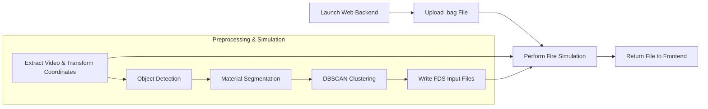

# Indoor Fire Simulation System based on Digital Twin
> Capstone Project -- Department of Computer Science

## Overview

This project aims to integrate material segmentation, image processing, and 3D visualization using depth and color streams from a Realsense camera. It includes modules for material estimation, segmentation, and point cloud visualization. The project is structured into multiple components:

- **demo_web**: A Flask web application for uploading media files and processing them.
- **material_segmentation**: Contains the material segmentation code and pre-trained models for identifying and estimating materials in images.
- **realsense**: Contains scripts for handling point cloud data and projecting 3D information using Intel Realsense devices.


## Prequisites

Before we start, make sure you have installed Anaconda.

## Installation

To run this project, first change directory to this repository, then run command below:
```
conda env create -f environment.yml
```
```
conda activate fire-dt
```

## Flowchart



## Usage
We expected to provide a web where users upload indoor photos to. To activate server, first check your server and client are connected to the same WLAN.
Next, run the following command to check your server's IP:
```
ipconfig
```
then change IP in `index.html`:
```
<your server IP>:5000
```
Finally, run this command to activate server, then type `<your server IP>:5000` on your client URL.
This command run `app.py` in module mode, as other repositories were designed for module.
```
python -m demo_web.app
```
 
Try to open web and type url `<your server IP>:5000` on your phone or other devices.
Then you will see a website!
**NOTE: two devices should connected to the SAME network.**
